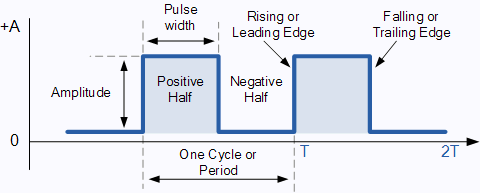
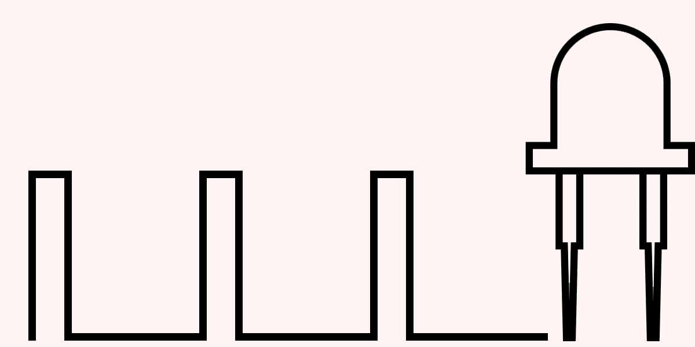

# Introduction

This is a collected set of pre-canned answers to questions that FRC people are likely to ask
players during competition.  All team members are expected to be able to answer questions on
this list on-demand at any time.

# PWM

## What is PWM?

PWM stands for Pulse-Width Modulation and is used anytime a digital system (such as our
RoboRIO) needs to set an analog percentage to a device such as a motor or an LED.

Shorter: PWM allows a *digital* system to *simulate* analog behavior.

## What do we use it for?

We don't always want to send 100% of 12V to the motors--sometimes we want to send only 50%,
or 10%, or similar.  PWM allows us to send that to the motors.  Similarly, PWM allows us to
set LEDs to 20% brightness or (in really complicated setups), even output audio to a speaker.

## How it works

This is a square wave:

Basically it turns on and off a certain number of times per second (the *frequency*), which
corresponds to a total cycle (the *period*).  Typically this frequency is several thousand
times per second, but can vary depending on the application.

Let's say we have PWM output to an LED.  As we vary what the wave looks like, see what
happens to the brightness of the LED:

The wider the positive part of the wave is, the brighter the LED is.  The narrower the
positive part of the wave is, the dimmer the LED is.  To figure out the *effective voltage*
of a PWM, you'll need to know the *duty cycle* first:

dutyCycle = positiveLength / totalPeriodLength

Note that dutyCycle will always be from 0 to 1.  Now to get the *effective voltage*, just
multiply the dutyCycle by the max voltage (aka *amplitude*):

effectiveVoltage = dutyCycle * maxVoltage

So if there's a 50% duty cycle and 12V, you get:

effectiveVoltage = 50% * 12V = 6V

Without going into too much detail, note that some components (like LEDs) can turn on and
off thousands of times per seconds, but require a minimum voltage to turn on at all.  So
you can do 3V at a 50% duty cycle at 1kHz and it will *appear* to be at 50% brightness, but
1.5V isn't actually enough to power a white LED, so 1.5 actual Volts won't turn it on at
all.
