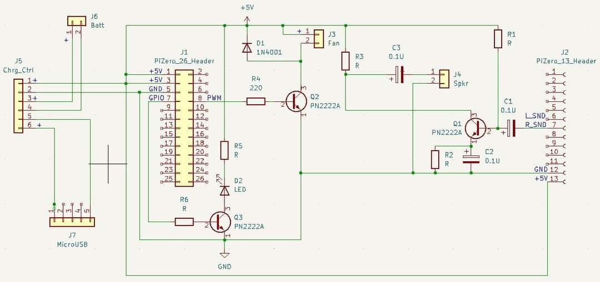

# OrangePi Zero-Based Wifi-Controlled Fan

## Introduction

The [OrangePi Zero](http://www.orangepi.org/html/hardWare/computerAndMicrocontrollers/details/Orange-Pi-Zero-LTS.html) is a tiny,
ARM-based single-board-computer (SBC) that has roughly the power of a 2012-era cellphone.  It comes with:

* A quad-core 32-bit ARM processor
* 256MB of RAM
* Boots from a MicroSD card
* An ethernet port and a Wifi interface
* A ton of general-purpose IO (GPIO) and other electrical interfaces for y'all to play with :-)

Given this year's FRC "Energize" theme, we'll be powering this device from a Lithium-Ion rechargable battery and using it to create
a wifi-controlled micro fan.

## Electronics

The Orange Pi Zero will be attached to a custom-designed *daughterboard* with the following stuff:

* An LED hooked up to GPIO PG06 (to make a blinkylight :-) ).
* A rudimentary small amplifier and a jack for a 2-pin 8-Ohm speaker.
* A similar rudimentary small amplifier hooked up to PWM1/PA06 that will drive a tiny 5V fan.

The basic schematic for the daughterboard is as follows:

The general idea for the robotics folks is to solder a header to the OPi and several to the daughterboard, along with some simple
electronics components (resistors, caps, a diode, and some transistors).

## OS and Software

This is an embedded device; no MacOS or Windows here :-).  The OS of choice for this board is probably
[Armbian Linux](https://armbian.com), which is an embedded-board-tuned variant of [Debian](https://debian.org).

The OS setup will include the stuff in this directory, namely:

* Set up the wifi as an access point and the ethernet adapter as a DHCP client.
* A copy of [FileBrowser](https://filebrowser.org), pointed at:
* A copy of [Apache Tomcat](https://tomcat.apache.org), which runs as a Java Servelet Pages (JSP) engine

The use of the JSP engine means that we can embed Java code directly into HTML pages, which is a good start for working with
the FRC code for our newbies.
